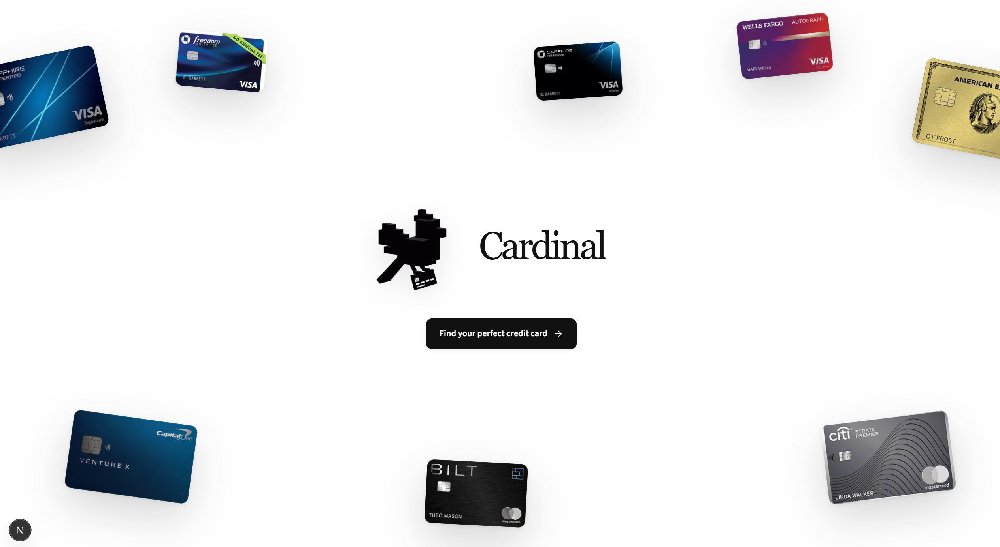
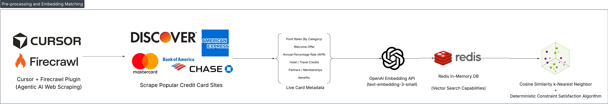
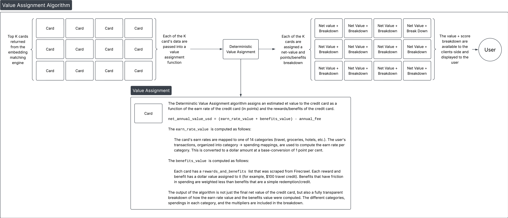

# Cardinal

Spend-aware credit card matching.



## Short description

Americans waste hours researching credit cards and often still leave thousands a year on the table. Most people keep a mismatched card or chase the loudest point bonus, because comparing fees, categories, and credits by hand is exhausting.

Cardinal turns your bank spending into clear picks: using OpenAI embedding models to transform your spending habits into a vector, finding similar cards with Redis Vector Search (kNN), and forecasting net annual savings.

**Less research. More money kept.**

---

## Inspiration

Choosing a credit card should take minutes. Instead, it is hours of comparing fees, categories, credits, and bonuses that change constantly. The average U.S. household holds about four cards and still leaves hundreds of dollars a year on the table, especially travelers, renters, grocery-heavy households, small-business owners, and anyone without time to research. Comparison sites dump tables; almost nothing starts from how you already spend. Cardinal turns bank spending into a clear pick, so people save time and save money.

## Our solution

Cardinal helps you find the perfect credit card not based on welcome offers or just higher point multipliers, but holistically by comparing credit cards to your real spending habits. We do this in a 2-step process:

### Step 1: Pre-processing of live credit cards

- Use the Cursor Firecrawl extension to crawl through 65+ real credit card issuers and extract metadata in JSON format, including point rates, welcome bonuses, benefits, and more.
- Convert this JSON metadata for each card into a structured string to pass into `text-embedding-3-small` (OpenAI Embedding Model).
- Append this embedding and associated card metadata into Redis (an in-memory DB) to leverage built-in vector search capabilities and in-memory design for low-latency fetches and similarity searches.



### Step 2: User similarity search (personalization)

- Ingest bank statements with PII redaction for privacy, then pass spending history into `text-embedding-3-small` (OpenAI embedding model).
- Using this vector embedding (which represents user spending history in high dimension), we use k-Nearest Neighbor cosine similarity search with Redis Vector Search to find cards that share general attributes based on your spending habits.
- Re-rank top-K results using a deterministic value assignment algorithm that scores earn rates against category spend, prices benefits, subtracts annual fees, and returns a transparent net annual savings breakdown.



## Challenges we ran into

1. **Embedding numbers (magnitude blindness | tokenization error):** Putting exact rates and dollar amounts into the embedding text backfired. Magnitude blindness means 1.5% vs 5% cash back barely differs as “similar text,” even though the economics are night and day. Tokenization can also scramble numbers (15,000 vs 150,000 may split differently and distort weight). Worse, “high” is ambiguous: a high APR and a high welcome bonus are both large, but one hurts. We strip numbers from the persona strings so embeddings find spend-style clusters (cashback vs points, dining vs travel, fee tier) and leave exact rates to the math re-ranker.

2. **Exploratory data analysis (Firecrawl | validation):** Issuer pages are messy HTML with inconsistent layouts. Firecrawl gave us clean, LLM-oriented extracts, but we still had to validate fields against the structured catalog, checking missing rates, odd fees, and incomplete benefits, so Redis wasn’t indexing junk. That QA loop was as important as the crawl itself.

## Accomplishments we're proud of

Shipping an end-to-end path from spend → embed → Redis kNN → dollar savings, with a clear split of responsibility: embeddings for persona clusters, hard filters for absolute no-gos, and deterministic math for forecasted savings. The live pipeline 3D visualization makes that split visible instead of hiding it in a black box.

## What we learned

Retrieval and ranking solve different problems. Stuffing rates into embeddings fails for the same reasons magnitude blindness and tokenization fail. Category-level, privacy-redacted spend is enough to personalize. Trust comes from showing users why a card ranked, not only that an embedding said so.

## What's next

1. Live bank connection to providers like Plaid.
2. Scheduled Firecrawl refreshes with re-embed only when stable terms change.
3. Boost aligned welcome offers at rank time without baking churny promos into the index; and multi-card portfolio recommendations with eval of recall/precision against labeled personas.

---

## Repo layout

| Path | Role |
| --- | --- |
| `frontend/` | Next.js demo app (landing → pipeline → recommendations) |
| `preprocess/` | Persona strings, embeddings, Redis load |
| `rewards/` | Deterministic value math and ranking |
| `matching/` | Retrieval / hard filters |
| `personas/` | Sample personas |
| `data/` | Credit card catalog |
| `redis_store/` | Redis helpers |

## Frontend

```bash
cd frontend
npm install
npm run dev
```

See `frontend/.env.local` for OpenAI / Redis configuration.
